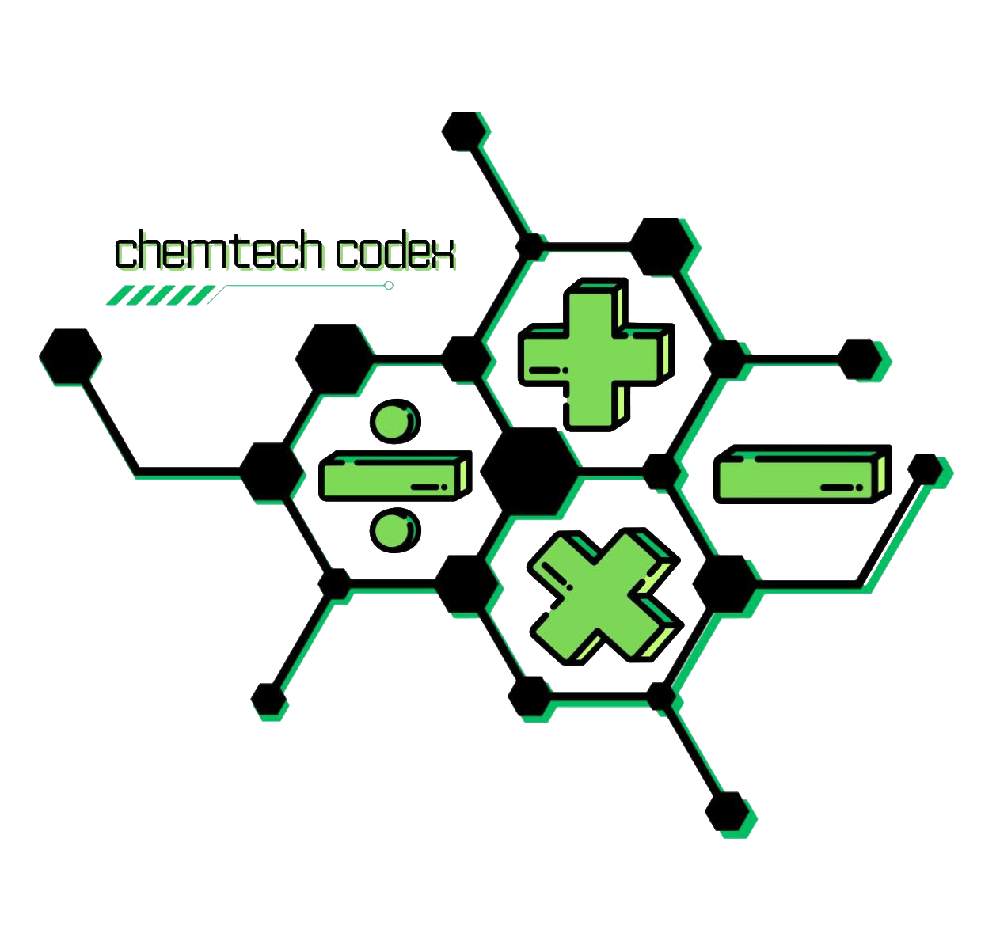
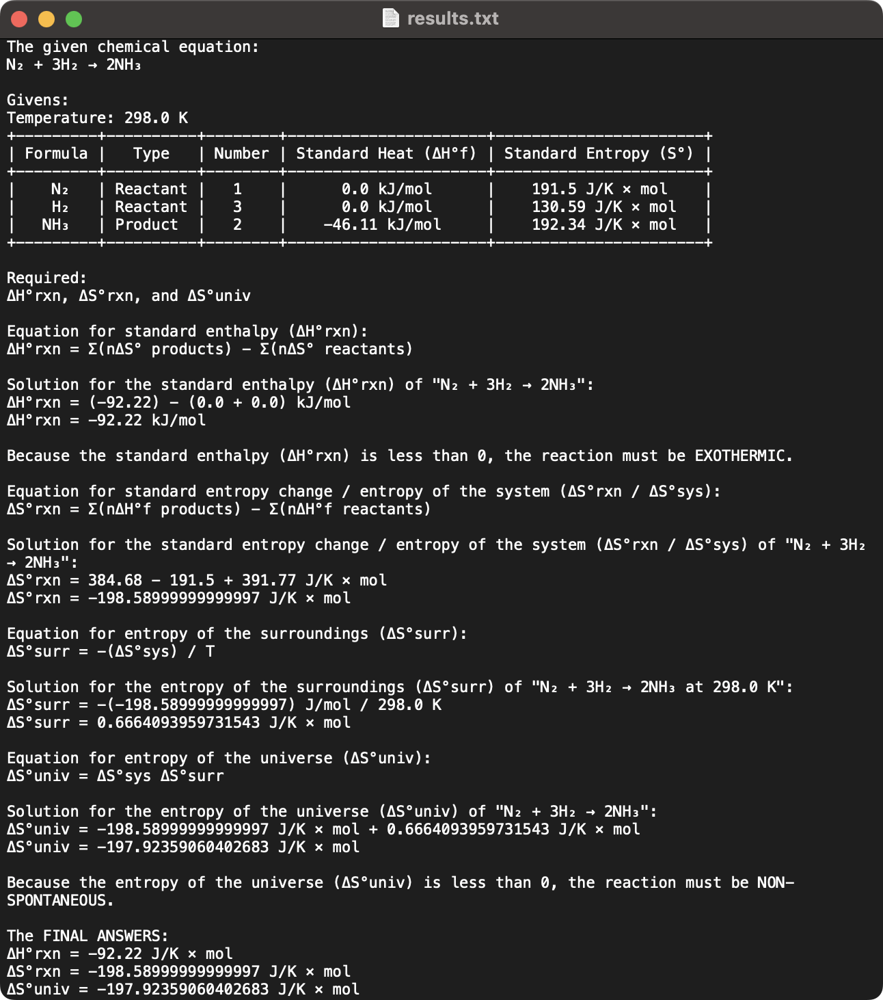

# Chemtech Codex

[](https://www.python.org/)



A calculator program that integrates and solves general chemistry concepts. It uses predefined formulas to solve for the
required values of each covered concept. The program creates an output text file by default, which can be disabled if
desired.

The following general chemistry concepts are covered:

1. **Thermochemistry** - Standard Enthalpy, Standard Entropy Change / System Entropy, Entropy of The Surroundings, and
   Entropy of The Universe.
2. **Chemical Kinetics** - First-Order Reactions
3. **Chemical Equilibrium** - Chemical Equilibrium Constants Using Molarities and Pressures
4. **Acids and Bases** - Potential of Hydrogen Ions and Hydroxide Ions

## Running

> [!IMPORTANT]
> Install the program's dependencies before running:
>
> ```shell
> pip install -r ./requirements.txt
> ```

```shell
python ./main.py
```

## Example

The output file from calculating the thermochemistry values of N₂ + 3H₂ → 2NH₃:



---


## De La Salle Santiago Zobel School (DLSZ)

- Empowerment Technologies (Emtech) & General Chemistry 2 (GenChem2)
- Academic Year 2023-2024
- Grade 12 (Senior High School), Term 3
- Performance Task (PT)
