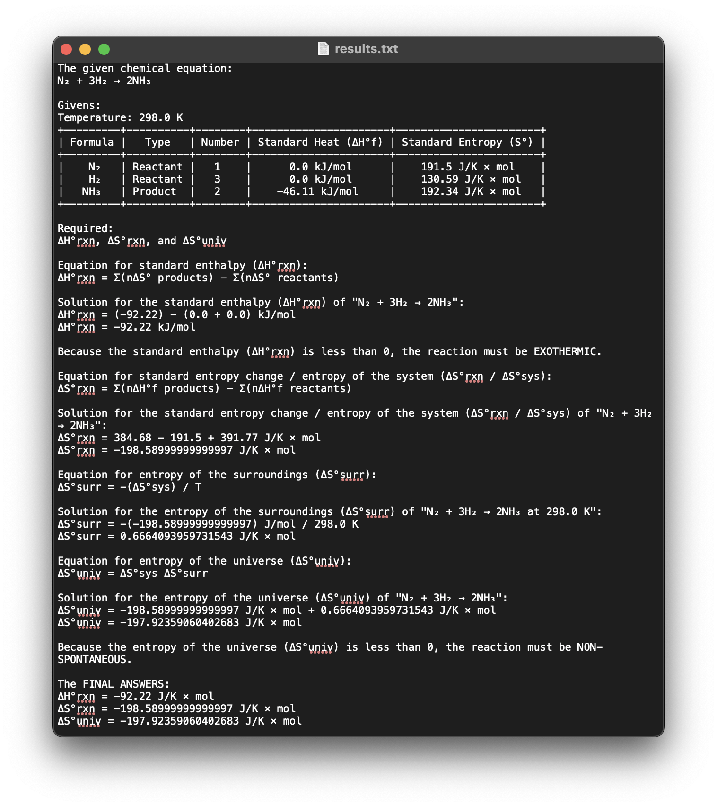

# 

[](https://www.python.org/)
[](https://github.com/astral-sh/ruff)

(ChemTech Codex is) A simple CLI-based calculator that solves and integrates General Chemistry 2 concepts. It takes inputs from the user and uses predetermined formulas to calculate values. The following General Chemistry 2 topics are covered:

1. **Thermochemistry** - Standard Enthalpy, Standard Entropy Change / System Entropy, Entropy of The Surroundings, and Entropy of The Universe.
2. **Chemical Kinetics** - First-Order Reactions
3. **Chemical Equilibrium** - Chemical Equilibrium Constants Using Molarities and Pressures
4. **Acids and Bases** - Potential of Hydrogen Ions and Hydroxide Ions

## Installing Dependencies

```bash
pip3 install -r ./requirements.txt
```

## Usage

```bash
python3 ./chemtechcodex/main.py
```

### Example

Here's a simple example of calculating the standard enthalpy of the reaction, standard entropy of the reaction, and entropy of the universe of the equation N₂ + 3H₂ → 2NH₃:



---


## De La Salle Santiago Zobel School (Senior High School)

This repository contains the source code of my group's performance task for **Empowerment Technologies** (Term 3, A.Y. 2023-24).
