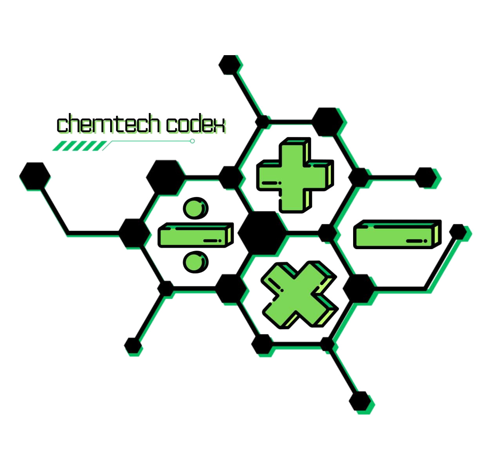

# 

[](https://www.python.org/)

A calculator program that integrates and solves general chemistry concepts. It uses predefined formulas to solve for the
required values of each covered concept. The program creates an output text file by default, which can be disabled if needed.

The following general chemistry concepts are covered:

1. **Thermochemistry** - Standard Enthalpy, Standard Entropy Change / System Entropy, Entropy of The Surroundings, and
   Entropy of The Universe.
2. **Chemical Kinetics** - First-Order Reactions
3. **Chemical Equilibrium** - Chemical Equilibrium Constants Using Molarities and Pressures
4. **Acids and Bases** - Potential of Hydrogen Ions and Hydroxide Ions

## Prerequisites

Install the program’s dependencies:

```bash
pip install -r ./requirements.txt
```

## Usage

```bash
python ./main.py
```

### Example


---


## De La Salle Santiago Zobel School (Senior High School)

This repository contains the source code of my group’s performance task for **Empowerment Technologies** and **General
Chemistry 2** (Term 3, A.Y. 2023-24).
